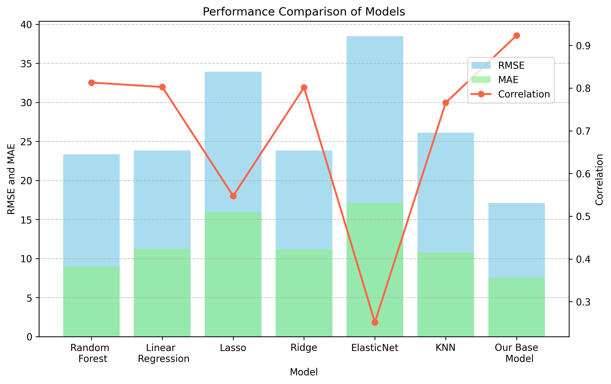
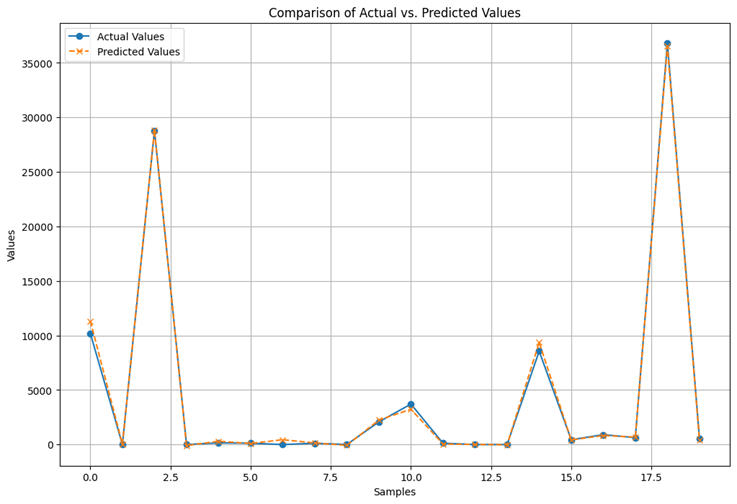

# INVENTORY MANAGEMENT MODEL USING TRANSFER LEARNING

## INTRODUCTION 

The aim of this project is to develop an inventory management system using deep learning approaches, highlighting the application of transfer learning. The central objective is to set up a reference model that optimizes stock levels, thus avoiding product excesses or shortages, while minimizing storage costs and maximizing sales opportunities. Our model accurately predicts specific demand for each product and is designed to adapt quickly to company-specific data by exploiting the advantages of transfer learning.

By adopting this approach, companies can benefit from several significant advantages:

1. **Supply optimization**: Optimal stock levels avoid costly overstocking while maintaining sufficient quantities to meet customer demand.
2. **Cost reduction**: More accurate inventory management reduces costs associated with holding stock and frequent replenishment.
3. **Improved customer service**: By avoiding stock-outs, companies can better meet customer demand, improving satisfaction and avoiding lost sales opportunities.
4. **Strategic planning**: Stock level forecasts help companies plan production, supplies, and resources more strategically.
5. **Anticipation of market trends**: Enables companies to anticipate fluctuations in demand and adapt sales strategies more effectively.

## OBJECTIVES 

- Develop a demand forecasting model based on Deep Learning for optimizing company inventories
- Use historical sales data, purchase price data, inventory levels, and other variables to train the model
- Implement transfer learning to enable companies to efficiently adapt the model to their specific data

After cloning the repository, download the datasets from [Google Drive](https://drive.google.com/drive/folders/1wV6t2emlxqnjgnhKZ0CjPSbYzm6H3rQV?usp=drive_link) and place them in the data/ directory.

## PROJECT STRUCTURE

The project is organized as follows:

```
project_root/
|-- checkpoint/
|   |-- base_model_checkpoint.h5                # Optimal weights for the basic model
|   |-- transfert_learning_model_checkpoint.h5  # Optimal weights for transfer learning
|
|-- data/
|   |-- 2017PurchasePricesDec.csv              # Details of product purchase and sale prices
|   |-- BegInvFinal1232016.csv                  # Inventory start date data by product and store
|   |-- EndInvFinal1232016.csv                  # Inventory end date data by product and warehouse
|   |-- InvoicePurchases12312016.csv            # Invoice data
|   |-- PurchasesFinal12312016.csv              # Product purchase data by store
|   |-- SalesFinal12312016.csv                  # Historical sales data
|   |-- preprocessing/                          # Folder containing the preprocessed data
|   |-- transfertLearning/                      # Folder containing target company data for transfer learning
|
|-- notebooks/
|   |-- data_exploration.ipynb                  # Data exploration
|   |-- data_preprocessing.ipynb                # Data preprocessing
|   |-- stock_management_model_development.ipynb # Design, hyperparameter search and training
|   |-- stock_management_model_evaluation.ipynb  # Model evaluation and comparison
|   |-- reference_models_training.ipynb         # Training and evaluation of reference models
|   |-- transfert_learning.ipynb                # Transfer Learning techniques for model adaptation
|
|-- src/
|   |-- data_preprocessing_utils.py             # Tools for data preprocessing
|   |-- model.py                                # Model architecture
|   |-- utils.py                                # Practical tools
|
|-- README.md                                   # This README file
|-- requirements.txt                            # Project dependencies
```

## DEPENDENCIES INSTALLATION

To ensure that this project runs smoothly, the following libraries must be installed:

- Python (version 3.8)
- TensorFlow (version 2.4)
- Keras
- scikit-learn (version 1.3)
- pandas (version 2.0) 
- matplotlib (version 3.7)
- numpy (version 1.20)
- PrettyTable

### SETTING UP AND CONFIGURING THE ENVIRONMENT

We'll set up an isolated environment using Anaconda:

1. **Installing Anaconda**:
   Download and install Anaconda from the official website: https://www.anaconda.com/download

2. **Setting up the environment**:
   - On Windows, open the "Anaconda Prompt" terminal. On Mac, access the terminal.
   - Navigate to the project's main directory
   - Add additional channels with the command:
     ```console
     $ conda config --add channels conda-forge
     ```
   - Create the environment with the required libraries:
     ```console
     $ conda create -n name_of_your_environment --file requirements.txt
     ```
   - Activate the environment:
     ```console
     $ conda activate environment_name
     ```
   - Install TensorFlow:
     ```console
     $ pip install tensorflow==2.4
     ```
   - Install PrettyTable:
     ```console
     $ pip install prettytable
     ```
   - Install ipykernel for Jupyter notebooks:
     ```console
     $ pip install ipykernel
     ```
   - Update typing-extensions to avoid package conflicts:
     ```console
     $ pip install typing-extensions==3.7.4
     ```

3. **Installing a text editor**:
   Install Visual Studio Code: https://code.visualstudio.com/

4. **Using the Environment in Visual Studio Code**:
   - Open the project directory using "File" > "Open Folder"
   - Open project notebooks and select your environment as "kernel" using "Select Kernel" > "Python Environments" > "name_of_your_environment"

To speed up training phases with GPU support: https://neptune.ai/blog/installing-tensorflow-2-gpu-guide

## SYSTEM ARCHITECTURE AND DESIGN

The system architecture comprises multiple layers designed for efficiency and scalability:

- **Data Layer**: Manages raw and preprocessed data, including historical sales and inventory records
- **Data Processing Layer**: Cleans, normalizes, and encodes data for analysis
- **Model Development Layer**: Builds and trains the base deep learning model (MLP) and benchmarks it against traditional methods
- **Transfer Learning Layer**: Adapts the base model to specific business requirements using fine-tuning techniques
- **Evaluation Layer**: Ensures model reliability through performance metrics

## PART 1: BASE MODEL FORMATION

This first part introduces the procedure for forming the initial inventory management model using historical sales data, product purchase price data, and other relevant variables. This initial model serves as a starting point for the subsequent application of transfer learning.

The data used in this project comes from a large distribution company offering a wide range of products. The dataset includes sales records, inventory levels, supplier invoices, and other relevant details. The company operates a total of 79 outlets and offers over 6890 distinct products. Sales data cover a two-month period, documenting transactions in all 79 stores.

### DATA PRE-PROCESSING

Before exploring the data, perform preprocessing as follows:
- In the notebook `notebook/data_preprocessing.ipynb`, load data from CSV files and organize in appropriate data structures
- Clean by processing missing values, eliminating outliers, and preparing data for subsequent analysis
- Save pre-processed data in the `data/preprocessing/` directory

### DATA EXPLORATION

After preprocessing:
- In the `data_exploration.ipynb` notebook, load the pre-processed data for exploratory analysis
- Perform analysis exploring time trends, sales, and relationships between different variables

### REFERENCE MODELS

Reference models have been developed to evaluate the performance of our inventory management model:
- Random Forest model
- Linear Regression Model
- Ridge
- Lasso
- ElasticNet
- K-Nearest Neighbors Regression

These models are trained using the same pre-processed data and provide a comparison benchmark.

### DESIGN, TRAINING AND OPTIMIZATION OF THE MODEL

The model is based on a MLP (Multilayer Perceptron) deep learning architecture. The notebook `stock_management_model_development.ipynb` presents the development steps:

1. Data Preparation and Formatting
2. Basic Model Creation with default parameters
3. Hyperparameter optimization using Bayesian optimization techniques
4. Training with Best Hyperparameters
5. Saving trained parameters for future use

### MODEL EVALUATION

The `stock_management_model_evaluation.ipynb` notebook compares model performance by loading optimized model weights, making predictions, and calculating error metrics.

| Model                   | RMSE    | Correlation | MAE     | RAE     | RRSE    | MAPE   | R2      |
|-------------------------|---------|-------------|---------|---------|---------|--------|---------|
| Random Forest           | 23.3435 | 0.812994    | 8.96228 | 0.504168| 0.58709 | 82.339 | 0.655325|
| Linear Regression       | 23.8307 | 0.802579    | 11.2327 | 0.631891| 0.599343| 218.499| 0.640788|
| Lasso                   | 33.9357 | 0.547551    | 15.9419 | 0.896799| 0.853486| 365.006| 0.271562|
| Ridge                   | 23.8388 | 0.801596    | 11.1452 | 0.626969| 0.599547| 214.896| 0.640543|
| ElasticNet              | 38.4939 | 0.251833    | 17.1119 | 0.962617| 0.968125| 397.283| 0.0627341|
| KNN                     | 26.1298 | 0.765809    | 10.7885 | 0.606903| 0.657167| 142.926| 0.568132|
| Stock Management Model  | 17.1057 | 0.923358    | 7.52769 | 0.406239| 0.3849  | 120.014| 0.85185 |



## PART 2: CASE STUDY WITH TRANSFER LEARNING

### INTRODUCTION

Transfer learning enables knowledge and skills acquired from training a model to be applied to a new and different task. In our inventory management project, transfer learning adapts our basic model to specific business requirements, reducing costs and improving forecast accuracy.

#### Objective:
This section demonstrates how our base model can adapt to particular requirements using the Favorita company as a case study. We'll follow these steps:
1. Loading the base model
2. Creating a customized version for Favorita
3. Re-training the model
4. Generating customized forecasts for this company

### USECASE DATA

We can use any data from company to use the pretrained model.

### MODEL ADAPTATION AND TRAINING

1. **Data loading and pre-processing**
   - In the `notebook/transfer_learning.ipynb`, load and preprocess Favorita's raw data
   - Clean data, eliminate outliers, and organize to match base model requirements

2. **Separation of training and test data**
   - Divide processed data into training and test sets
   - Use training data for fine-tuning and test data for evaluation

3. **Creating a customized model for your UseCase**
   - Create your useCase-specific template based on the pre-trained base model
   - Make specific adjustments to meet Favorita's unique needs
   - These may include adding layers, modifying parameters, or incorporating company-specific features

### RESULTS

The evaluation results of our transfer learning approach are impressive:
- Correlation: 0.988
- Mean Absolute Error (MAE): 860.05
- Relative Absolute Error (RAE): 0.0565
- Root Mean Squared Error (RMSE): 4,805.80
- Relative Root Squared Error (RRSE): 0.1524
- Coefficient of Determination (R2): 0.9767



## FUTURE ENHANCEMENTS

Consider these possible extensions to further leverage the model:

### API Integration
Integrate the model into existing systems via an API for real-time demand forecasting, automatic stock level adjustments, and order recommendations.

### Web Interface Development with Flask
Develop a user-friendly web interface using Flask to allow team members to easily interact with the model for inventory forecasts, simplifying order planning and supply chain optimization.

### Business Customization
Customize the model for your specific business needs by adding neural network layers, tailoring inputs/outputs, and refining parameters to improve forecast accuracy.

### Integration of Other Data Sources
Enrich forecasts by incorporating additional relevant data sources like weather data or seasonal events to account for more factors influencing demand.

### Ongoing Training
Implement continuous training processes to keep the model updated with the latest market trends, periodically reassessing performance and adjusting parameters as necessary.

## Members
Chinmoy Saikia
Subhadip Guha Roy
Tushar Kumar

## License
This project is licensed under the GNU General Public License v3.0 License - see the [LICENSE](LICENSE.txt) file for details.
